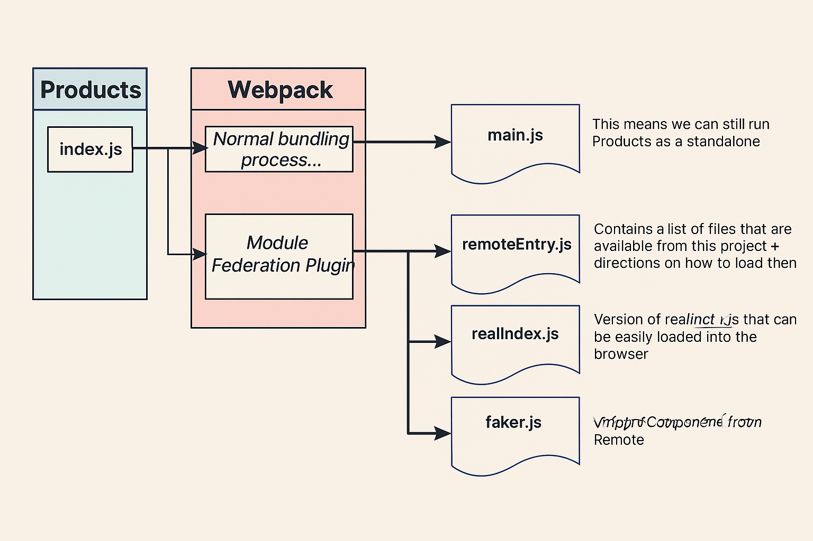

## 1. What is webpack 

Combine many js file into one single file

## 2. Module federation

- Designate one app as the Host (CONTAINER) and one as the Remote (PRODUCTS).

- In the Remote, decide which modules (files) you want to make available to other projects.

- Set up the Module Federation plugin to expose those files.

- In the Host, decide which files you want to get from the Remote.

- Set up the Module Federation plugin to fetch those files.

- In the Host, refactor the entry point to load asynchronously.

- In the Host, import whatever files you need from the remote.

**What module federation does in products application:**



**Container (Host App) — Data Flow with `bootstrap.js`:**

```js
┌────────────────────────────┐
│        Container App       │
│                            │
│  index.js                  │
│  └── import('./bootstrap') │
│                            │
│  bootstrap.js              │
│  └── import('products/XYZ')│
│                            │
└────────────┬───────────────┘
             │
             ▼
        ┌────────────┐
        │  Webpack   │
        └────┬───────┘
             │
             ▼
  ┌────────────────────┐         ┌──────────────────────────────┐
  │     main.js        │◄────────┤  Only contains contents of   │
  │                    │         │         index.js             │
  └────────────────────┘         └──────────────────────────────┘

             ▼
  ┌────────────────────┐         ┌──────────────────────────────┐
  │   bootstrap.js     │◄────────┤ Contains bootstrap.js.       │
  │                    │         │ Webpack knows it must load   │
  │                    │         │ remotes (e.g. Products)      │
  │                    │         │ before executing this file   │
  └────────────────────┘         └──────────────────────────────┘
```

Microfrontend Runtime Loading Flow (Container & Products)

```js
         ┌─────────────────────────────────────────────┐
         │      Container Webpack Dev Server (8080)    │
         └─────────────────────────────────────────────┘
                        │
                        ▼
               main.js is loaded and executed
                        │
                        ▼
           ┌──────────────────────────────┐
           │ We need to load bootstrap.js │
           └──────────────────────────────┘
                        │
                        ▼
    bootstrap.js needs a file from Products remote!
         Fetch → remoteEntry.js
                        │
                        ▼
    remoteEntry.js tells us where to find:
     ┌────────────┬───────────────┐
     │ src_index.js │ faker.js    │
     └────────────┴───────────────┘
                        │
                        ▼
      All remote files are fetched successfully
                        │
                        ▼
      Execute bootstrap.js after loading remotes

```

Summary Runtime Sequence:

- User opens `localhost:8080` (Container App).

- `main.js` runs and dynamically loads `bootstrap.js`.

- `bootstrap.js` tries to import from `products/`.

- It triggers loading of `remoteEntry.js` from Products.

- `remoteEntry.js` defines how to fetch `src_index.js`, `faker.js`.

- Once fetched, `bootstrap.js` executes successfully.

